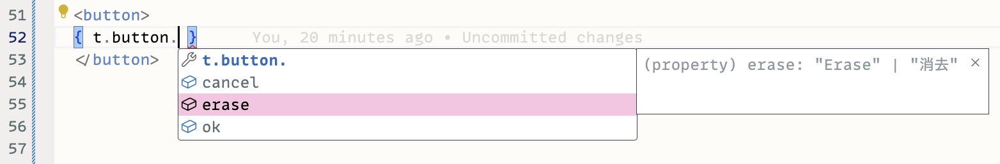

# @axhxrx/internationalization

This library attempts to provide the simplest possible implementation of internationalization (sometimes nonsensically abbreviated as "i18n") for TypeScript projects. It provides some generalized building blocks to make apps easily localizable.

The canonical format for defining translations is just TypeScript code, instead of JSON/YAML/etc. Such translations can then be imported directly, without any extra build steps.

Since translations are TypeScript code, the language server provides as-you-type error checking, autocompletion, and documentation hints in most editors at the point of use.

The drawback to this approach is that the translation format, although simple, may be unfamiliar to translators, and isn't widely compatible with other translation tools. Those issues can be solved, but that's outside the scope of this library.

## High-level overview

This library isn't quite a complete solution; it's more like a set of blocks that can be used to implement a solution.

The key concepts are:

- A **`Locale`** is a string that uniquely identifies a language or variant of a language.Examples might be `'en'` for English, `'ja'` for Japanese, or `'en_US'` / `'en_GB'` for more specific variants of English.

- A [**`LocalizedUnit`**](./LocalizedUnit.ts) is a single item of text content that has been translated into all the supported locales. This is represented as a TypeScript type where each key is a locale identifier and each value is the translated string.

```ts
const exampleLocalizedUnit = {
  de: 'Werwolf',
  en: 'werewolf',
  ja: '狼人',
} as const;
```

- A [**`Localization`**](./Localization.ts) is a set of `LocalizedUnit` objects. A small app might have a single `Localization` for the whole app, but most apps will have a `Localization` for each page or component. That native form of a `Localization` is TypeScript code, like this:

```ts
const exampleLocalization = {
  button: {
    save: {
      de: 'Speichern',
      en: 'Save',
      ja: '保存',
    },
    edit: {
      de: 'Bearbeiten',
      en: 'Edit',
      ja: '編集',
    },
    cancel: {
      de: 'Abbrechen',
      en: 'Cancel',
      ja: 'キャンセル',
    },
  }
};
```

At runtime, the above code boils down to a simple JS object that is a tree structure whose leaf nodes are `Localization` objects. This makes it easy to combine multiple `Localization` objects into one, or winnow them down to a single locale. Depending on the app's structure, and build process, it may also be easy to dynamically import translations over the network.

The structure is important, because the `LocalizedUnit` objects that contain the translated strings are referenced by the **key path** into the `Localization` tree structure (e.g., `'button.save'`).

- The [**localize()**](./localize.ts) function performs the job of selecting the right translation string from a `LocalizedUnit` object, based on the current locale.

- The [**interpolate()**](./interpolate.ts) function performs the common task of replacing placeholders within a translation string with dynamic values provided at runtime. This requires escaping untrusted values, and this library provides an **escapeHTML()** function to do that for HTML content.

## Usage

Implement translations for your supported locales in one or more TypeScript files:

```ts
const localizations = {
  button: {
    erase: {
      en: 'Erase',
      ja: '消去' ,
    },
    ok: {
      en: 'OK',
      ja: 'OK',
    },
    cancel: {
      en: 'Cancel',
      ja: 'キャンセル',
    },
  },
  greeting: {
    en: 'Welcome {{ username }}',
    ja: 'ようこそ {{username}}',
  },
};

// Optionally, extract the translations for a single locale at runtime for convenience and/or efficiency:
const t = localizeAll(localizations);
```

In your app code, import the translations and then use them. E.g. in a web app template:

```html
<button>
  {{ t.button.erase }}
</button>
<p>
  {{ interpolate(t.greeting, { username }) }}
</p>
```

Any decent TypeScript editors supports autocompletion and documentation hints for the properties of these strongly-typed `Localization` and related objects: 



This library can also be used in apps other than web apps:

```typescript
// e.g. a CLI tool or something:
const menu = `
  1. ${localizations.button.erase}
  2. ${localizations.button.cancel}
`;
console.log(menu);
```

## Happenings

✨ 2025-03-17: version 0.0.9: improve `isLocalization()` with some type fuckery, to be a type-narrowing type guard, which is convenient enough a the point of use to be worth it

🔧 2025-01-31: version 0.0.8: fix missing export

🔧 2025-01-31: version 0.0.7: fix bug, add `isLocalization()`

📖 2025-01-25: version 0.0.6: update docs

⏱️ 2025-01-19: version 0.0.5: add test for TypeScript type-checking performance (to avoid inadvertent introduction of "slow types")

🩹 2025-01-18: version 0.0.4: Fix missing export

✨ 2025-01-18: version 0.0.3: Add valueAtKeyPath() utility function

👹 2025-01-18: version 0.0.2 adds tree conversion with localizeAll(), and fixes up some type-related stuff

👹 2025-01-18: initial draft of implementation

🤖 2025-01-13: repo initialized by Bottie McBotface bot@axhxrx.com
